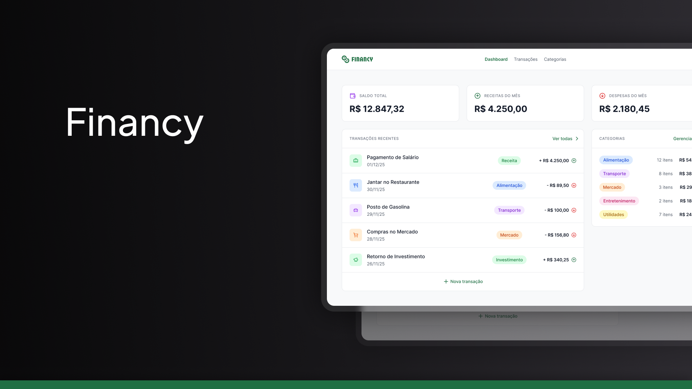

# Financy

Aplicação de **finanças pessoais** para controle de receitas, despesas e categorias. Frontend em React e backend em Node.js com API GraphQL e banco SQLite.



## Funcionalidades

- **Autenticação** — Login e cadastro de usuários (JWT)
- **Dashboard** — Resumo de saldo, receitas e despesas; últimas transações e gastos por categoria
- **Transações** — Cadastro, edição e exclusão de receitas e despesas com data e categoria
- **Categorias** — Criação e edição de categorias com ícone e cor
- **Perfil** — Atualização do nome do usuário

## Stack

| Camada   | Tecnologias                                                                                                                       |
| -------- | --------------------------------------------------------------------------------------------------------------------------------- |
| Frontend | React 18, TypeScript, Vite, TailwindCSS, React Query, React Hook Form, Zod, React Router, GraphQL (graphql-request), Lucide React |
| Backend  | Node.js, TypeScript, Apollo Server (GraphQL), Prisma, SQLite (better-sqlite3), bcryptjs, JWT                                      |
| Banco    | SQLite (arquivo local)                                                                                                            |

## Estrutura do projeto

```
financy/
├── frontend/          # App React (Vite)
│   ├── src/
│   │   ├── components/   # UI, dialogs, layout
│   │   ├── contexts/    # AuthContext
│   │   ├── graphql/     # Queries e mutations
│   │   ├── hooks/       # useAuth, useTransactions, useCategories
│   │   ├── lib/         # Cliente GraphQL, utils
│   │   └── pages/       # Login, Cadastro, Dashboard, Transações, Categorias, Perfil
│   └── package.json
├── backend/           # API GraphQL (Apollo + Prisma)
│   ├── prisma/
│   │   └── schema.prisma   # User, Category, Transaction
│   ├── src/
│   │   ├── schema/     # typeDefs e resolvers
│   │   ├── utils/      # auth (JWT)
│   │   └── server.ts
│   └── package.json
└── README.md
```

## Configuração

### Backend

```bash
cd backend
yarn install
```

Copie o arquivo de exemplo e configure as variáveis:

```bash
cp .env.example .env
```

Edite o `.env`:

```
DATABASE_URL="file:./dev.db"
JWT_SECRET="sua-chave-secreta-aqui"
```

Gere o cliente Prisma e aplique as migrations:

```bash
yarn prisma generate
yarn prisma migrate dev
```

Inicie o servidor:

```bash
yarn dev
```

Por padrão a API fica em `http://localhost:3001` e o endpoint GraphQL em `http://localhost:3001/graphql`.

### Frontend

```bash
cd frontend
yarn install
```

Copie o arquivo de exemplo e defina a URL do backend:

```bash
cp .env.example .env
```

No `.env`:

```
VITE_BACKEND_URL=http://localhost:3001
```

Inicie o frontend:

```bash
yarn dev
```

A aplicação abre em `http://localhost:5173` (ou a porta indicada pelo Vite).

## Variáveis de ambiente

| Variável           | Onde     | Descrição                                     |
| ------------------ | -------- | --------------------------------------------- |
| `DATABASE_URL`     | Backend  | URL do SQLite (ex: `file:./dev.db`)           |
| `JWT_SECRET`       | Backend  | Chave para assinatura dos tokens JWT          |
| `PORT`             | Backend  | Porta do servidor (padrão: 3001)              |
| `VITE_BACKEND_URL` | Frontend | URL base da API (ex: `http://localhost:3001`) |
